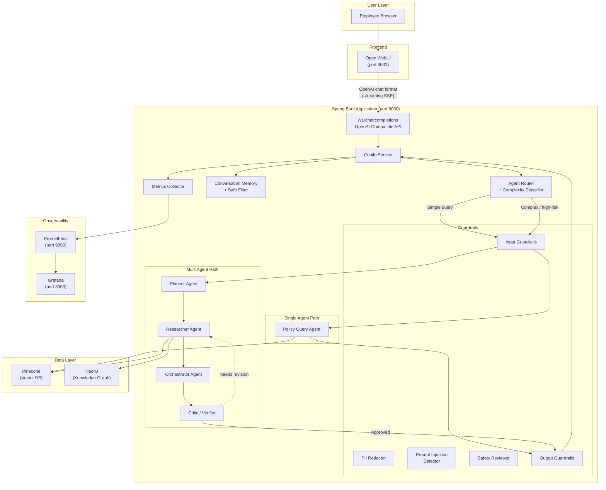
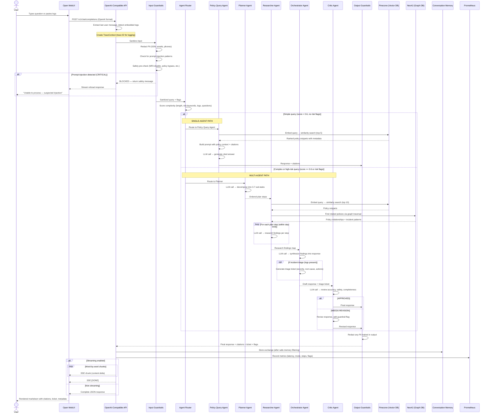

# Policy & Incident Copilot

We built this tool because employees kept asking the same policy questions across Slack, email, and support tickets — and incident triage was eating up hours of L1 time on repetitive first-pass work. The idea was simple: give people a single chat interface where they can ask about company policies or paste an error log and get a useful answer in seconds, not hours.

It runs on **LangChain4J** + **LangGraph4J** for the AI orchestration, **Pinecone** for document search, **Neo4J** for understanding how policies relate to each other, and **Open WebUI** as the chat frontend so nobody has to learn a new tool — it looks and feels like ChatGPT.

---

## What Does It Actually Do?

**Two modes, one interface:**

- **Quick answers** — An employee asks _"What's the password reset process?"_ and gets back the right policy excerpt with the version number and date, in under a few seconds. One LLM call, no fuss.

- **Incident triage** — Someone pastes 200 lines of VPN error logs and says _"This is affecting the whole APAC team."_ The system spins up a team of AI agents — a planner figures out what to investigate, a researcher digs through policies and logs, an orchestrator writes up a triage ticket, and a critic double-checks everything before it goes out.

The system decides which mode to use on its own. Short, clear question? Single agent. Long messy logs, multiple questions, or anything touching security controls? Multi-agent with safety review. You can also force a mode if you want.

---

## How Everything Fits Together

Here's the big picture of what talks to what:

### Integration Flowchart



### Request Lifecycle — Sequence Diagram

This is what happens from the moment you hit "Send" in the chat to when the answer appears:



---

## Tech Stack

| What | Why we picked it |
|------|-----------------|
| **Open WebUI** | Familiar ChatGPT-like interface — zero training needed for employees |
| **Spring Boot 3.3** | Team already knows it, great ecosystem for enterprise Java |
| **LangChain4J 0.36** | Best-in-class Java LLM integration — handles embeddings, chat models, RAG plumbing |
| **LangGraph4J 1.5** | Stateful agent graphs with conditional edges — perfect for the multi-agent workflow |
| **Pinecone** | Managed vector DB — we didn't want to babysit infrastructure for embeddings |
| **Neo4J 5** | Policies have relationships (supersedes, depends on, escalates to) — graphs model this naturally |
| **all-MiniLM-L6-v2** | Fast local embeddings via ONNX — no API call needed for vector search |
| **Prometheus + Grafana** | Standard observability stack the ops team already uses |
| **Docker Compose** | One command to spin up everything locally |
| **Java 21** | Virtual threads, pattern matching, text blocks — modern Java is actually nice |

---

## Project Layout

```
src/main/java/com/copilot/
├── PolicyIncidentCopilotApplication.java     # Spring Boot entry point
│
├── config/
│   ├── LangChainConfig.java                 # Embedding model + Pinecone (or in-memory fallback)
│   ├── Neo4jConfig.java                     # Graph DB connection
│   └── WebConfig.java                       # CORS + async SSE for Open WebUI
│
├── controller/
│   ├── CopilotController.java               # Direct REST API (/api/v1/copilot/*)
│   └── OpenAICompatibleController.java      # OpenAI-format bridge for Open WebUI
│
├── service/
│   ├── CopilotService.java                  # Main orchestration — routing, execution, response
│   └── PolicyIngestionService.java          # Chunk + embed + store policy documents
│
├── agent/
│   ├── router/
│   │   ├── AgentRouter.java                 # Decides single vs multi based on classifier
│   │   └── ComplexityClassifier.java        # Scores query complexity + risk
│   ├── single/
│   │   └── PolicyQueryAgent.java            # Retrieve → prompt → answer (one LLM call)
│   └── multi/
│       ├── PlannerAgent.java                # Breaks request into sub-tasks
│       ├── ResearcherAgent.java             # Executes each task against policies + graph
│       ├── OrchestratorAgent.java           # Combines findings → draft + triage ticket
│       └── CriticAgent.java                 # Reviews for accuracy and safety
│
├── graph/
│   ├── SingleAgentGraph.java                # LangGraph4J: guardrail → query → guardrail
│   └── MultiAgentGraph.java                 # LangGraph4J: guardrail → plan → research → orchestrate → critic → guardrail
│
├── retrieval/
│   ├── PolicyRetriever.java                 # High-level retrieval interface
│   ├── PineconeVectorStore.java             # Semantic similarity search
│   ├── Neo4jKnowledgeGraph.java             # Cypher queries for policy relationships
│   └── DocumentChunker.java                 # Recursive text splitting (512 tokens, 64 overlap)
│
├── guardrails/
│   ├── GuardrailsEngine.java               # Runs all checks in order
│   ├── PromptInjectionDetector.java         # 7 pattern categories + heuristic scoring
│   ├── PIIRedactor.java                     # Regex-based redaction (SSN, CC, email, phone)
│   └── SafetyReviewer.java                  # Blocks dangerous requests + flags unsafe outputs
│
├── memory/
│   ├── ConversationMemory.java              # Per-session history with eviction
│   └── SafeMemoryFilter.java               # Strips secrets before anything hits memory
│
├── observability/
│   ├── TraceContext.java                    # Creates trace IDs, wires into SLF4J MDC
│   └── MetricsCollector.java               # Counters, timers, histograms → Prometheus
│
└── model/
    ├── CopilotRequest.java                  # What comes in
    ├── CopilotResponse.java                 # What goes out (with citations)
    ├── GraphState.java                      # Shared state across all agents in a graph run
    ├── PolicySnippet.java                   # A chunk of policy with metadata
    └── TriageTicket.java                    # Structured incident output
```

---

## Getting Started

### What You'll Need

- **Java 21** or newer
- **Docker + Docker Compose** (for Neo4J, Prometheus, Grafana, Open WebUI)
- An **Anthropic API key** (or swap in OpenAI — just change the config)
- Optionally, a **Pinecone API key** (without one, it falls back to an in-memory vector store which works fine for dev)

### Setup

**1. Clone it**
```bash
git clone https://github.com/kantheti73/policy_incident_copilot.git
cd policy_incident_copilot
```

**2. Set your API keys**
```bash
export ANTHROPIC_API_KEY=your-key-here
export PINECONE_API_KEY=your-pinecone-key     # skip this for local dev
export PINECONE_ENVIRONMENT=us-east-1          # skip this for local dev
```

**3. Start everything**
```bash
docker-compose up --build
```

That's it. Once the containers are up:

| Service | URL | Notes |
|---------|-----|-------|
| Chat UI (Open WebUI) | http://localhost:3001 | Main interface for employees |
| Copilot API | http://localhost:8080 | Direct REST + OpenAI-compatible endpoints |
| Neo4J Browser | http://localhost:7474 | Explore the policy knowledge graph |
| Prometheus | http://localhost:9090 | Raw metrics |
| Grafana | http://localhost:3000 | Dashboards (login: admin / admin) |

**Prefer running the app locally?** Start just the infrastructure:
```bash
docker-compose up -d neo4j prometheus grafana open-webui
./mvnw spring-boot:run
```

---

## Using the Chat UI

Open http://localhost:3001 in your browser. You'll see a clean chat interface.

**Pick a model from the dropdown:**

- **policy-copilot** — The default. Handles everything. Simple questions go through the fast single-agent path; complex ones automatically escalate to multi-agent with planning and verification.
- **incident-triage** — Forces the full multi-agent pipeline every time. Use this when you're pasting logs and want thorough analysis with a triage ticket.

**What the response includes:**

The chat renders everything as markdown, so you'll see:
- The actual answer with inline policy citations
- A **Sources** section listing every policy document referenced (with version and relevance score)
- For incidents: a **Triage Ticket** with severity, affected systems, root cause hypothesis, and recommended next steps
- If any guardrails fired: a note explaining what was flagged
- A metadata footer with the agent mode used, step count, latency, and trace ID (useful for debugging)

**How it works under the hood:**

Open WebUI thinks it's talking to an OpenAI API. Our `OpenAICompatibleController` speaks that protocol — it accepts `/v1/chat/completions` requests, translates them into our internal format, runs them through the full copilot pipeline, and streams the response back as SSE chunks. The UI doesn't know or care that there's a multi-agent system behind the curtain.

---

## API Reference

You can also hit the API directly (useful for integrations, scripts, or testing).

**Policy question:**
```bash
curl -X POST http://localhost:8080/api/v1/copilot/query \
  -H "Content-Type: application/json" \
  -d '{
    "query": "What is the current password reset process?",
    "userId": "emp-123",
    "sessionId": "session-abc"
  }'
```

**Incident triage with logs:**
```bash
curl -X POST http://localhost:8080/api/v1/copilot/query \
  -H "Content-Type: application/json" \
  -d '{
    "query": "VPN failing for 200 users since maintenance window",
    "userId": "oncall-456",
    "sessionId": "session-xyz",
    "rawLogs": "2024-01-15 10:00:00 ERROR vpn-gateway Connection timeout for user=jdoe\n..."
  }'
```

**Upload a policy document:**
```bash
curl -X POST http://localhost:8080/api/v1/copilot/ingest \
  -H "Content-Type: application/json" \
  -d '{
    "documentId": "POL-001",
    "title": "Password Reset Policy",
    "content": "All employees must reset passwords every 90 days...",
    "version": "2.1",
    "effectiveDate": "2024-01-01",
    "category": "Security"
  }'
```

---

## Configuration

Everything lives in `src/main/resources/application.yml`. The important knobs:

| Setting | What it controls | Default |
|---------|-----------------|---------|
| `copilot.routing.complexity-threshold` | How "complex" a query needs to be before it triggers multi-agent mode (0.0–1.0) | `0.6` |
| `copilot.routing.high-risk-keywords` | Words that automatically trigger multi-agent + safety review | `disable mfa`, `ignore policy`, `bypass`, etc. |
| `copilot.guardrails.max-steps-single-agent` | Cap on LLM calls for simple queries (keeps latency low) | `3` |
| `copilot.guardrails.max-steps-multi-agent` | Cap on LLM calls for complex workflows (prevents runaway loops) | `10` |
| `copilot.memory.max-conversation-turns` | How many exchanges to remember per session | `20` |
| `copilot.retry.max-attempts` | How many times to retry a failed LLM call | `3` |

---

## Running Tests

```bash
# Everything
./mvnw test

# Just the guardrail tests
./mvnw test -Dtest=PromptInjectionDetectorTest,PIIRedactorTest,SafetyReviewerTest

# Just the routing tests
./mvnw test -Dtest=ComplexityClassifierTest
```

The test suite covers prompt injection detection, PII redaction, safety rule enforcement, complexity classification, and memory filtering. They run without any external services.

---

## What's Next

A few things on the roadmap that haven't been built yet:

- **Evaluation framework** — Automated pass/fail scoring against a golden dataset of policy questions
- **Webhook notifications** — Push triage tickets to Slack, PagerDuty, or Jira automatically
- **Document versioning UI** — Let policy owners upload new versions through the web interface
- **Fine-tuned routing model** — Replace the heuristic classifier with a small trained model
- **Audit trail** — Persistent log of every query, response, and guardrail decision for compliance

---

## License

MIT
