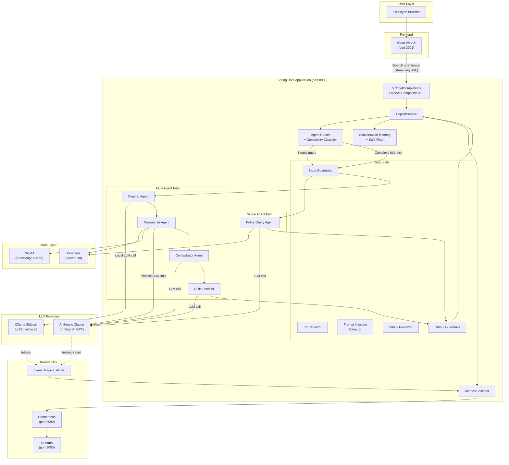
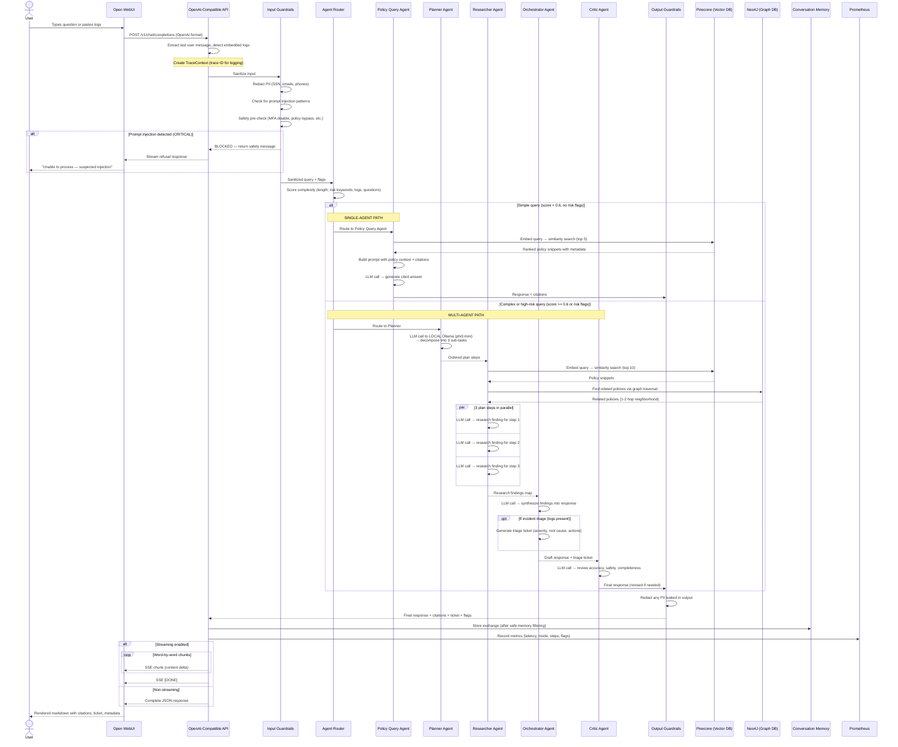

# Policy & Incident Copilot

We built this tool because employees kept asking the same policy questions across Slack, email, and support tickets — and incident triage was eating up hours of L1 time on repetitive first-pass work. The idea was simple: give people a single chat interface where they can ask about company policies or paste an error log and get a useful answer in seconds, not hours.

It runs on **LangChain4J** + **LangGraph4J** for the AI orchestration, **Pinecone** for document search, **Neo4J** for understanding how policies relate to each other, **Ollama** for a local lightweight planner model, and **Open WebUI** as the chat frontend so nobody has to learn a new tool — it looks and feels like ChatGPT.

The system is designed to be **provider-agnostic** for the heavy reasoning — drop in either an Anthropic Claude key or an OpenAI key and the right model gets picked up automatically. The planner uses a local Ollama model (`phi3:mini` by default) to keep latency and cost down for the simple task of breaking a request into steps.

---

## What Does It Actually Do?

**Two modes, one interface:**

- **Quick answers** — An employee asks _"What's the password reset process?"_ and gets back the right policy excerpt with the version number and date, in under a few seconds. One LLM call, no fuss.

- **Incident triage** — Someone pastes 200 lines of VPN error logs and says _"This is affecting the whole APAC team."_ The system spins up a team of AI agents — a planner figures out what to investigate, a researcher digs through policies and logs, an orchestrator writes up a triage ticket, and a critic double-checks everything before it goes out.

The system decides which mode to use on its own. Short, clear question? Single agent. Long messy logs, multiple questions, or anything touching security controls? Multi-agent with safety review. You can also force a mode if you want.

---

## How Everything Fits Together

Here's the big picture of what talks to what:

### Integration Flowchart



### Request Lifecycle — Sequence Diagram

This is what happens from the moment you hit "Send" in the chat to when the answer appears:



---

## Tech Stack

| What | Why we picked it |
|------|-----------------|
| **Open WebUI** | Familiar ChatGPT-like interface — zero training needed for employees |
| **Spring Boot 3.3** | Team already knows it, great ecosystem for enterprise Java |
| **LangChain4J 0.36** | Best-in-class Java LLM integration — handles embeddings, chat models, RAG plumbing, and listener-based observability |
| **LangGraph4J 1.8.11** | Stateful agent graphs — perfect for the multi-agent workflow. Stable release. |
| **Anthropic Claude / OpenAI GPT** | Either provider works for the heavy-reasoning agents — pick whichever your org uses. Both wired in via LangChain4J. |
| **Ollama + phi3:mini** | Local 3.8B-parameter model for the Planner agent — sub-2-second task decomposition with zero API cost |
| **Pinecone** | Managed vector DB — we didn't want to babysit infrastructure for embeddings |
| **Neo4J 5** | Policies have relationships (supersedes, depends on, references) — graphs model this naturally. Auto-seeded on startup with 12 policies and 21 relationships. |
| **all-MiniLM-L6-v2** | Fast local embeddings via ONNX (384 dimensions) — no API call needed for vector search |
| **Prometheus + Grafana** | Standard observability stack. Custom metrics for token usage, cost, latency, and guardrail events. |
| **Podman / Docker Compose** | One command to spin up everything locally |
| **Java 21** | Virtual threads, pattern matching, text blocks — modern Java is actually nice |

---

## Project Layout

```
src/main/java/com/copilot/
├── PolicyIncidentCopilotApplication.java     # Spring Boot entry point
│
├── config/
│   ├── ChatModelConfig.java                 # Builds primary (Anthropic/OpenAI) + planner (Ollama) chat model beans
│   ├── CopilotProperties.java               # @ConfigurationProperties for routing, guardrails, memory, LLM pricing
│   ├── LangChainConfig.java                 # Embedding model + Pinecone (or in-memory fallback)
│   ├── Neo4jConfig.java                     # Graph DB connection
│   └── WebConfig.java                       # CORS + async SSE for Open WebUI
│
├── controller/
│   ├── CopilotController.java               # Direct REST API (/api/v1/copilot/*)
│   └── OpenAICompatibleController.java      # OpenAI-format bridge for Open WebUI
│
├── service/
│   ├── CopilotService.java                  # Main orchestration — routing, execution, response
│   └── PolicyIngestionService.java          # Chunk + embed + store policy documents
│
├── agent/
│   ├── router/
│   │   ├── AgentRouter.java                 # Decides single vs multi based on classifier
│   │   └── ComplexityClassifier.java        # Scores query complexity + risk
│   ├── single/
│   │   └── PolicyQueryAgent.java            # Retrieve → prompt → answer (one LLM call)
│   └── multi/
│       ├── PlannerAgent.java                # Breaks request into sub-tasks
│       ├── ResearcherAgent.java             # Executes each task against policies + graph
│       ├── OrchestratorAgent.java           # Combines findings → draft + triage ticket
│       └── CriticAgent.java                 # Reviews for accuracy and safety
│
├── graph/
│   ├── SingleAgentGraph.java                # LangGraph4J: guardrail → query → guardrail
│   └── MultiAgentGraph.java                 # LangGraph4J: guardrail → plan → research → orchestrate → critic → guardrail
│
├── retrieval/
│   ├── PolicyRetriever.java                 # High-level retrieval interface
│   ├── PineconeVectorStore.java             # Semantic similarity search
│   ├── Neo4jKnowledgeGraph.java             # Cypher queries for policy relationships (keyword-based matching)
│   ├── Neo4jPolicyGraphSeeder.java          # ApplicationRunner — seeds 12 policies + 21 relationships at startup
│   └── DocumentChunker.java                 # Recursive text splitting (512 tokens, 64 overlap)
│
├── guardrails/
│   ├── GuardrailsEngine.java               # Runs all checks in order
│   ├── PromptInjectionDetector.java         # 7 pattern categories + heuristic scoring
│   ├── PIIRedactor.java                     # Regex-based redaction (SSN, CC, email, phone)
│   └── SafetyReviewer.java                  # Blocks dangerous requests + flags unsafe outputs
│
├── memory/
│   ├── ConversationMemory.java              # Per-session history with eviction
│   └── SafeMemoryFilter.java               # Strips secrets before anything hits memory
│
├── observability/
│   ├── TraceContext.java                    # Creates trace IDs, wires into SLF4J MDC
│   ├── MetricsCollector.java                # Counters, timers, histograms → Prometheus
│   └── TokenUsageListener.java              # ChatModelListener — captures tokens + cost on every LLM call
│
└── model/
    ├── CopilotRequest.java                  # What comes in
    ├── CopilotResponse.java                 # What goes out (with citations)
    ├── GraphState.java                      # Shared state across all agents in a graph run (Serializable for LangGraph4J 1.8)
    ├── PolicySnippet.java                   # A chunk of policy with metadata
    └── TriageTicket.java                    # Structured incident output

src/main/resources/
├── application.yml                          # All config: routing, guardrails, LLM providers, pricing
└── seed-policies/                           # 12 sample IT security policies (NIST/DoD/CIS aligned)
    ├── SEC-001-password-policy.json         # Password requirements
    ├── SEC-002-mfa-policy.json              # Multi-factor auth
    ├── SEC-003-network-security-policy.json # Firewalls and segmentation
    ├── SEC-004-endpoint-security-policy.json
    ├── SEC-005-data-protection-policy.json
    ├── SEC-006-incident-response-policy.json
    ├── SEC-007-access-control-policy.json
    ├── SEC-008-secure-development-policy.json
    ├── SEC-009-email-security-policy.json
    ├── SEC-010-cloud-security-policy.json
    ├── OPS-001-change-management-policy.json
    └── OPS-002-backup-recovery-policy.json
```

---

## Getting Started

### What You'll Need

- **Java 21** or newer (only needed if running the app outside containers)
- **Podman + podman-compose** *or* **Docker + Docker Compose**
- A **Doppler account** with the API keys loaded — see _Secrets management with Doppler_ below
- Optionally, a **Pinecone API key** (in Doppler) — without one, the app falls back to an in-memory vector store which works fine for dev but loses data on every restart

### Secrets management with Doppler

This project uses [Doppler](https://doppler.com) for secret management. All API keys (Anthropic, OpenAI, Pinecone) live in Doppler — your laptop only stores a single bootstrap token. The Doppler CLI runs inside the `copilot-app` container at startup, fetches the secrets, and exports them as environment variables before the JVM launches. Spring Boot resolves `${ANTHROPIC_API_KEY}` and friends from those env vars exactly like before — no Java code changes were needed.

**One-time setup in Doppler:**

1. Sign up at [doppler.com](https://doppler.com) and create a project named `policy_incident_copilot_project`
2. Create a config (the example uses `dev_personal`)
3. Add these secrets to the config:

| Secret | Required? | Notes |
|---|---|---|
| `ANTHROPIC_API_KEY` | One of these | Activates Claude as the primary reasoning model |
| `OPENAI_API_KEY` | One of these | Activates GPT as the primary reasoning model |
| `PINECONE_API_KEY` | Optional | Without this, the app uses an in-memory vector store |

`PINECONE_ENVIRONMENT` is **not** a secret — it stays in `.env`.

4. Generate a **Service Token** for your config (read-only, scoped to one config). It looks like `dp.st.dev_personal.xxxxxxxxxxxxxxxxxx`.

### Setup

**1. Clone it**
```bash
git clone https://github.com/kantheti73/policy_incident_copilot.git
cd policy_incident_copilot
```

**2. Create your `.env` file**

```bash
cp .env.example .env
```

Open `.env` and paste your Doppler service token:

```env
DOPPLER_TOKEN=dp.st.dev_personal.your-token-here
PINECONE_ENVIRONMENT=us-east-1
PLANNER_LOCAL_ENABLED=true
PLANNER_MODEL=phi3:mini
```

That's the entire `.env` file. No API keys live on your laptop — they're all in Doppler.

**Note for local non-container runs (`./mvnw spring-boot:run`):** The Doppler CLI is only installed inside the container image. If you want to run the app directly on the host without containers, install the [Doppler CLI](https://docs.doppler.com/docs/install-cli) on your machine and run `doppler run --project policy_incident_copilot_project --config dev_personal -- ./mvnw spring-boot:run`.

**3. (Optional) Set up Pinecone**

If you want persistent vector storage, create a Pinecone index named `policy-documents` with these settings:

| Setting | Value |
|---|---|
| Dimensions | **384** (must match the embedding model) |
| Metric | Cosine |
| Cloud | Any region (default `us-east-1`) |

⚠️ **The dimension must be exactly 384** — the local `all-MiniLM-L6-v2` embedding model produces 384-dim vectors. A mismatched index will cause `Vector dimension N does not match the dimension of the index 384` errors during ingestion.

**4. Start everything**
```bash
podman compose up --build
# or: docker compose up --build
```

The first boot takes longer because Ollama needs to pull `phi3:mini` (~2.3GB, one-time download cached in a named volume).

That's it. Once the containers are up:

| Service | URL | Notes |
|---------|-----|-------|
| Chat UI (Open WebUI) | http://localhost:3001 | Main interface for employees |
| Copilot API | http://localhost:8080 | Direct REST + OpenAI-compatible endpoints |
| Neo4J Browser | http://localhost:7474 | Explore the policy knowledge graph (login: `neo4j` / `copilot-secret`) |
| Ollama | http://localhost:11434 | Local model runtime (status check via `/api/tags`) |
| Prometheus | http://localhost:9090 | Raw metrics |
| Grafana | http://localhost:3000 | Dashboards (login: `admin` / `admin`) |

**5. Load the seed policies**

The repo ships with 12 sample IT security policies based on NIST, DoD STIG, and CIS Controls (`src/main/resources/seed-policies/`). Upload them all in one shot:

```bash
for f in src/main/resources/seed-policies/*.json; do
  curl -s -X POST http://localhost:8080/api/v1/copilot/ingest \
    -H "Content-Type: application/json" \
    -d @"$f"
  echo
done
```

You should see `{"documentId":"SEC-001","chunksCreated":9,"status":"SUCCESS"}` etc. for all 12 policies (~153 chunks total).

The Neo4j knowledge graph is **automatically seeded on every startup** with policy nodes and `RELATES_TO` / `DEPENDS_ON` / `REFERENCES` edges — no manual step required. Look for `Neo4j policy graph ready: 12 Policy nodes, 21 relationships` in the app logs.

**Prefer running the app locally and the rest in containers?** Install the Doppler CLI on your host and wrap the Spring Boot launch:
```bash
podman compose up -d neo4j prometheus grafana open-webui ollama
doppler run --project policy_incident_copilot_project --config dev_personal -- ./mvnw spring-boot:run
```

---

## Using the Chat UI

Open http://localhost:3001 in your browser. You'll see a clean chat interface.

**Pick a model from the dropdown:**

- **policy-copilot** — The default. Handles everything. Simple questions go through the fast single-agent path; complex ones automatically escalate to multi-agent with planning and verification.
- **incident-triage** — Forces the full multi-agent pipeline every time. Use this when you're pasting logs and want thorough analysis with a triage ticket.

**What the response includes:**

The chat renders everything as markdown, so you'll see:
- The actual answer with inline policy citations
- A **Sources** section listing every policy document referenced (with version and relevance score)
- For incidents: a **Triage Ticket** with severity, affected systems, root cause hypothesis, and recommended next steps
- If any guardrails fired: a note explaining what was flagged
- A metadata footer with the agent mode used, step count, latency, and trace ID (useful for debugging)

**How it works under the hood:**

Open WebUI thinks it's talking to an OpenAI API. Our `OpenAICompatibleController` speaks that protocol — it accepts `/v1/chat/completions` requests, translates them into our internal format, runs them through the full copilot pipeline, and streams the response back as SSE chunks. The UI doesn't know or care that there's a multi-agent system behind the curtain.

---

## API Reference

You can also hit the API directly (useful for integrations, scripts, or testing).

**Policy question:**
```bash
curl -X POST http://localhost:8080/api/v1/copilot/query \
  -H "Content-Type: application/json" \
  -d '{
    "query": "What is the current password reset process?",
    "userId": "emp-123",
    "sessionId": "session-abc"
  }'
```

**Incident triage with logs:**
```bash
curl -X POST http://localhost:8080/api/v1/copilot/query \
  -H "Content-Type: application/json" \
  -d '{
    "query": "VPN failing for 200 users since maintenance window",
    "userId": "oncall-456",
    "sessionId": "session-xyz",
    "rawLogs": "2024-01-15 10:00:00 ERROR vpn-gateway Connection timeout for user=jdoe\n..."
  }'
```

**Force multi-agent mode** (bypass auto-routing — useful for testing the full pipeline):
```bash
curl -X POST http://localhost:8080/api/v1/copilot/query \
  -H "Content-Type: application/json" \
  -d '{
    "query": "Walk me through password requirements and how they relate to MFA.",
    "forceMode": "MULTI"
  }'
```

**Upload a policy document:**
```bash
curl -X POST http://localhost:8080/api/v1/copilot/ingest \
  -H "Content-Type: application/json" \
  -d '{
    "documentId": "POL-001",
    "title": "Password Reset Policy",
    "content": "All employees must reset passwords every 90 days...",
    "version": "2.1",
    "effectiveDate": "2024-01-01",
    "category": "Security"
  }'
```

---

## Configuration

Everything lives in `src/main/resources/application.yml` and is overridable via environment variables (typically through your `.env` file).

### Routing & guardrails

| Setting | What it controls | Default |
|---------|-----------------|---------|
| `copilot.routing.complexity-threshold` | Score threshold to trigger multi-agent mode (0.0–1.0) | `0.6` |
| `copilot.routing.high-risk-keywords` | Words that auto-trigger multi-agent + safety review | `disable mfa`, `disable firewall`, `bypass`, `give me the password`, `install software`, `ip address`, etc. |
| `copilot.guardrails.max-steps-single-agent` | Cap on LLM calls for simple queries | `3` |
| `copilot.guardrails.max-steps-multi-agent` | Cap on LLM calls for complex workflows | `10` |
| `copilot.guardrails.pii-patterns` | Regex patterns redacted from input/output (SSN, CC, email, phone, internal IPs) | See `application.yml` |
| `copilot.memory.max-conversation-turns` | How many exchanges to remember per session | `20` |

### LLM providers

| Setting / env var | Purpose | Default |
|---|---|---|
| `ANTHROPIC_API_KEY` | Activates Claude as the primary reasoning model | unset |
| `OPENAI_API_KEY` | Activates GPT as the primary reasoning model (if Anthropic key isn't set) | unset |
| `ANTHROPIC_MODEL` | Override the Claude model name | `claude-sonnet-4-20250514` |
| `OPENAI_MODEL` | Override the OpenAI model name | `gpt-4o` |
| `PLANNER_LOCAL_ENABLED` | Use local Ollama for the planner. Set `false` to reuse the primary model. | `true` |
| `PLANNER_MODEL` | Local Ollama model name (must be pulled by the sidecar) | `phi3:mini` |
| `OLLAMA_BASE_URL` | Where to reach Ollama. Defaults to the in-network sidecar. | `http://ollama:11434` |
| `copilot.llm.max-tokens` | Max tokens per completion | `4096` |
| `copilot.llm.temperature` | Sampling temperature | `0.1` |

### Token & cost tracking

The app captures token usage on every LLM call (Anthropic, OpenAI, *and* Ollama) via a `ChatModelListener` and emits Prometheus metrics tagged by `model` and `provider`. Cost is computed from a price table in `application.yml`:

```yaml
copilot:
  llm-pricing:
    models:
      claude-sonnet-4-20250514:
        input-per-million: 3.00
        output-per-million: 15.00
      gpt-4o:
        input-per-million: 2.50
        output-per-million: 10.00
      phi3:mini:
        input-per-million: 0.00
        output-per-million: 0.00
```

Edit this section when providers change pricing — no code change needed.

**Metrics emitted:**

| Metric | Type | Tags |
|---|---|---|
| `copilot_llm_tokens_input_total` | Counter | `model`, `provider` |
| `copilot_llm_tokens_output_total` | Counter | `model`, `provider` |
| `copilot_llm_tokens_total` | Counter | `model`, `provider` |
| `copilot_llm_calls_total` | Counter | `model`, `provider` |
| `copilot_llm_cost_usd_total` | Counter | `model`, `provider` |
| `copilot_llm_tokens_per_call` | Distribution (p50/p95/p99) | `model`, `provider` |

**Useful PromQL queries for Grafana:**

| Panel | Query |
|---|---|
| Total spend (last 24h) | `sum(increase(copilot_llm_cost_usd_total[24h]))` |
| Cost rate ($/hour) | `sum(rate(copilot_llm_cost_usd_total[5m])) * 3600` |
| Anthropic vs Ollama call ratio | `sum by (provider) (rate(copilot_llm_calls_total[5m]))` |
| Avg tokens per request | `sum(rate(copilot_llm_tokens_total[5m])) / sum(rate(copilot_requests_total[5m]))` |

---

## Running Tests

```bash
# Everything
./mvnw test

# Just the guardrail tests
./mvnw test -Dtest=PromptInjectionDetectorTest,PIIRedactorTest,SafetyReviewerTest

# Just the routing tests
./mvnw test -Dtest=ComplexityClassifierTest
```

The test suite covers prompt injection detection, PII redaction, safety rule enforcement, complexity classification, and memory filtering. They run without any external services.

---

## What's Next

A few things on the roadmap that haven't been built yet:

- **Pre-built Grafana dashboards** — Auto-provisioned dashboards for token spend, latency, guardrail events, and request volume so a fresh `compose up` lands with charts already in place
- **Evaluation framework** — Automated pass/fail scoring against a golden dataset of policy questions
- **Webhook notifications** — Push triage tickets to Slack, PagerDuty, or Jira automatically
- **Document versioning UI** — Let policy owners upload new versions through the web interface
- **Per-agent token attribution** — Use MDC threading so token metrics can be tagged with the agent name (planner / researcher / orchestrator / critic), not just the model
- **LLM-extracted graph relationships** — Auto-generate Neo4j edges from policy content instead of hand-curating them
- **Fine-tuned routing model** — Replace the heuristic classifier with a small trained model
- **Audit trail** — Persistent log of every query, response, and guardrail decision for compliance

---

## License

MIT
